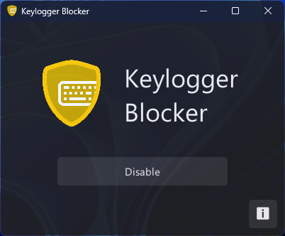
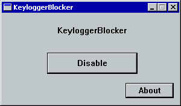

#  KeyloggerBlocker

|Windows 7+ (Modern)                |Windows 2000+ & ReactOS (Legacy)  |
|-----------------------------------|----------------------------------|
||          |

> An anti-keyloger for Windows 2000+ and ReactOS

## Abilities

* Hotkey support
* Notification support (Only Modern Version)
* Tray-Menu support
* Smaller than 3MB¹
* A lot keyboard layout
* ~0,2% CPU Usage and ~28MB RAM Usage²
* Dark Mode Support and UWP Similar UI (Only Modern Version)
* Written in V & C.

¹: Legacy Version is smaller than 100KB

²: ~0% CPU Usage and ~2MB RAM Usage for Legacy Version

> View the app with real applications [KeyloggerBlocker vs Random Keyloggers - Youtube](https://youtu.be/SlXk6JGTENI)

## License

* This project licensed by GPLv3.

## Toolkit

|Mode  |Requirenments|
|------|-------------|
|Modern|V (latest), GCC (latest)|
|C-Port|Clang (latest)|
|Legacy|GCC (4.7.1)   |

## Libraries

* [MUI](https://github.com/malisipi/mui) - Apache 2.0 License
* [tray.h](https://gist.github.com/malisipi/ec70678d9b1c931130902ab97ac68938) - MIT License
* [Bootstrap Icons](https://icons.getbootstrap.com/) - MIT License

## To-Do List

* [x] Keylogger-blocking system
* [ ] Blocking keyloggers that has screen-recording ability
* [ ] Blocking window-recordings from screen
* [ ] Supporting autostarting
* [ ] A special keyboard protocol with Arduino
* [ ] Winlogon support
* [ ] A (built-in) virtual keyboard

## Disclaimer

This software was created for educational purposes. It was produced with the thought of being useful. It does not claim to protect the user from all keyloggers. There is a possibility that some keyloggers can bypass this software. It's always a good idea to use a security software.